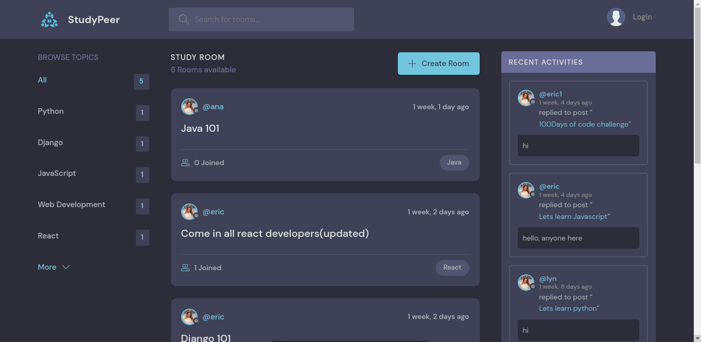

# studypeeer

# Description
+ Study Peer is a platform which consists of rooms and for each rooms a certain group of people can join a study together, it also allows users to user the CRUD operations. Example users can create or delete a room of their choice.

## Installation

+ Clone this repository and `cd` to the cloned repository's directory.
+ Run `python install -r requirements.txt`

## Usage

+ Run `python manage.py runserver` to run the app
